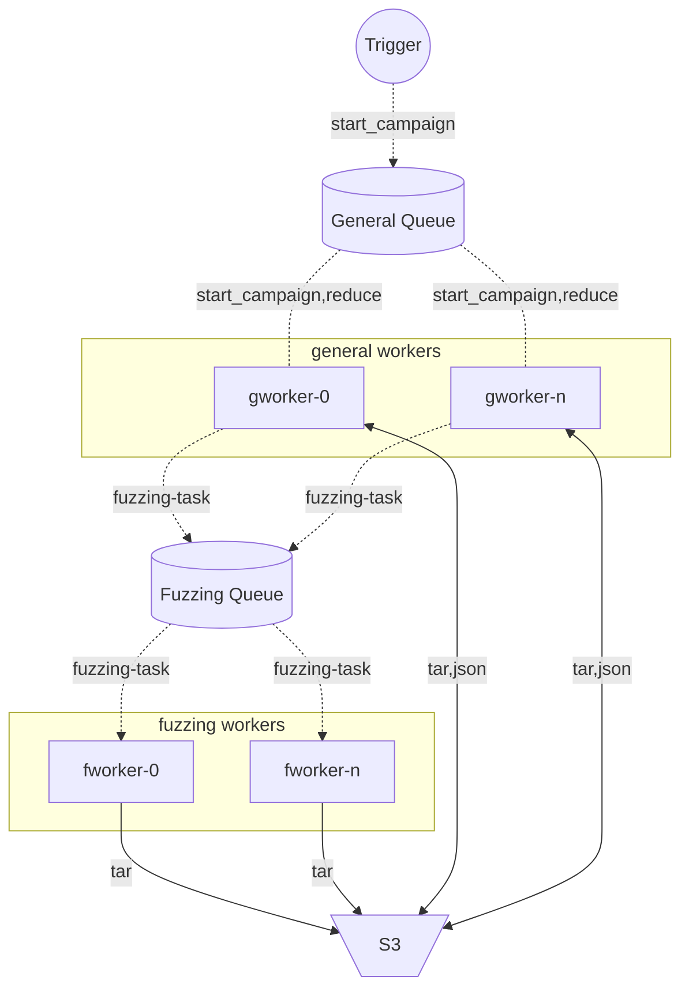

# dMagma


[](https://github.com/psf/black)
[](https://codecov.io/gh/cgfandia-tii/dmagma)

Distributed Magma fuzzing benchmark

## Overview

> ⚠️ There has to be only one fuzzing worker per VM

## Development
### Setup
1. Define a development environment ```.env``` in the same directory of the ```docker-compose.yml```:
    ```
    SHARED_VOLUME=shared-workdir-volume
    SHARED_PATH=/tmp/shared-workdir
    BROKER_USER=guest
    BROKER_PASS=guest
    S3_ACCESS_KEY=access_key
    S3_SECRET_KEY=secret_key
    ```
2. Bootstrap the required services:
    ```shell
    docker compose up -d tasks-broker tasks-result tasks-monitor s3
    ```
3. Install dependencies
    ```shell
    # all tests and executions have to be done in the context of the "src" folder
    cd src
    pip install -r requirements.txt -r requirements.dev.txt
    ```
4. Perform the tests

### Tests
Just to check that everything works:
```shell
docker compose up -d tasks-broker tasks-result s3 fuzzing-worker general-worker
cd src
pytest
```
If you want more control:
```shell
cd src
# Test locally (on the host)
export SHARED_PATH=/tmp/shared-workdir
export SHARED_VOLUME=${SHARED_PATH}
# Clear created docker images and partially S3 storage after the tests
export CLEAR_CACHE=1
pytest -m "not celery"
```
Test the celery tasks:
1. Start the fuzzing worker
    ```shell
    # Test locally (on the host)
    export SHARED_PATH=/tmp/shared-workdir
    export SHARED_VOLUME=${SHARED_PATH}
    ./run-fuzzing-worker.sh -l INFO
    ```
2. Start the general worker in the new terminal
    ```shell
    ./run-general-worker.sh -l INFO
    ```
3. Run the tests in another terminal
    ```shell
    pytest -m "celery"
    ```
### TODO
- [ ] API
- [ ] Remove dependency from the same docker volume of the fuzzing workers
